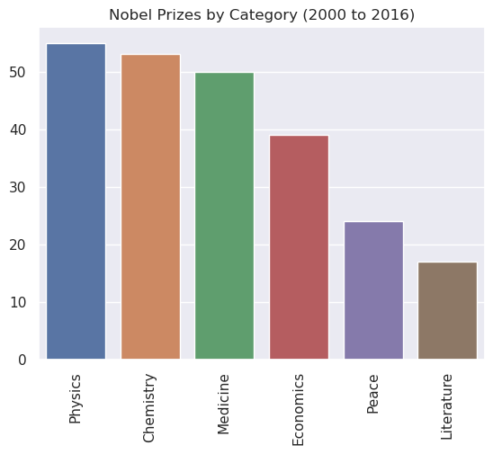
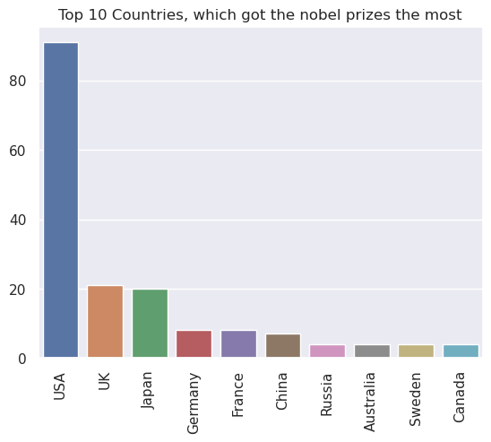
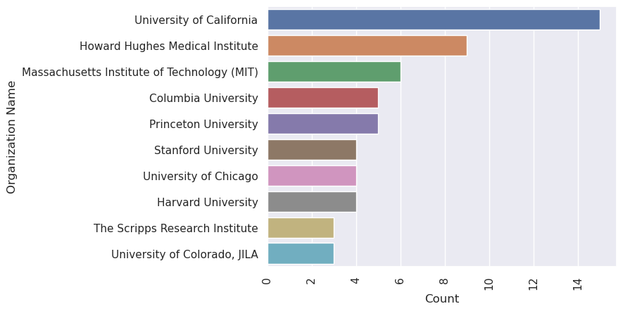

# Data Analysis of Nobel prize winner between 2000 to 2016

- This is a Data Science project about the Nobel prize winner between 2000 to 2016. after running this program we get 3 graphs which shows different information about Nobel prize.

- Created by using Python, Pandas, Seaborn, and Matplotlib.

## Screenshots

